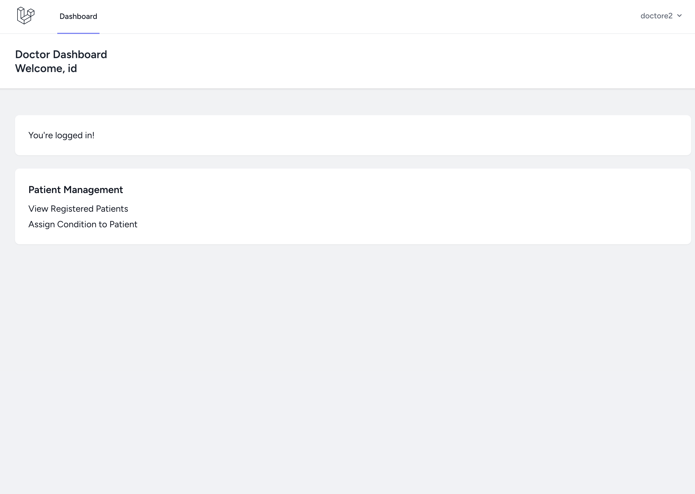
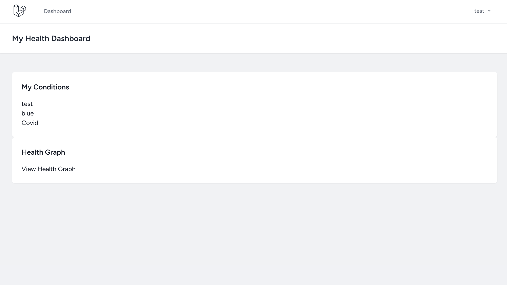
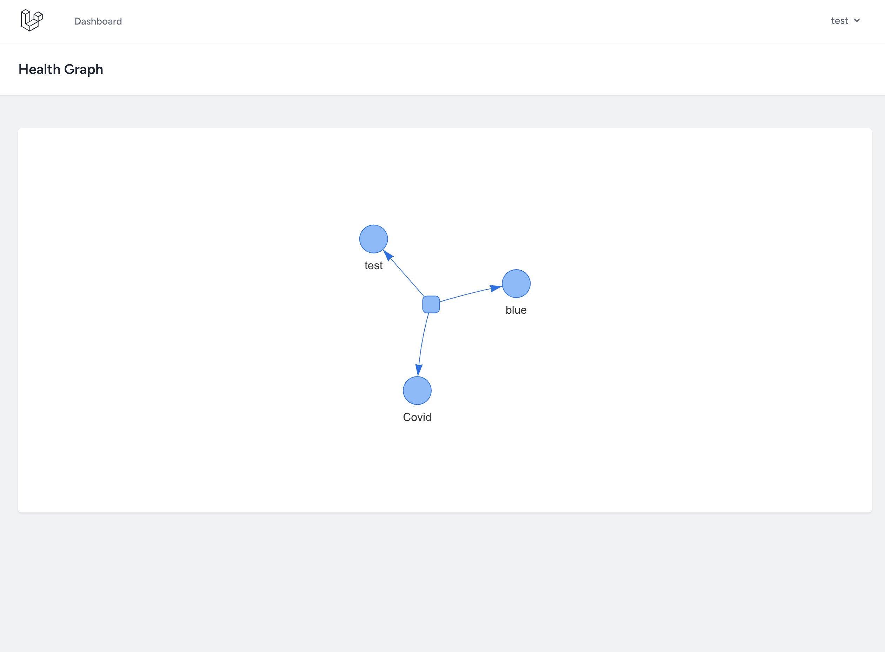

# 🏥 Healthcare Tracker – Laravel + Neo4j

This is a simple healthcare management app built with **Laravel**, **MySQL**, and **Neo4j**, designed to demonstrate modern full-stack engineering practices in a realistic medical context.

It includes authentication, role-based dashboards, patient record management, and a graph-based health visualization system using Neo4j.

---

## 🚀 Features

### ✅ Authentication
- Laravel Breeze
- Role selection on registration (Doctor or Patient)
- Separate dashboards for doctors and patients

### 🩺 Doctor Dashboard
- Add new **Patients**
- View list of assigned **Patients**
- Create **Medical Conditions** and link them to each Patient via Neo4j

📸 _Screenshot: Doctor Dashboard_  


---

### 🧑‍⚕️ Patient Dashboard
- See personalized welcome message
- Access an interactive **Health Graph**

📸 _Screenshot: Patient Health Graph_  


---

### 🌐 Health Graph Visualization
- Real-time Neo4j data visualization using **Vis.js**
- Each condition linked to the patient node
- Expandable architecture for relationships like medications, treatments, etc.

📸 _Screenshot: Neo4j Graph_  


---

## 🧱 Tech Stack

- **Laravel** with Sail (Dockerized)
- **MySQL** for relational data (users, roles, etc.)
- **Neo4j** for graph data (health conditions)
- **jQuery** for frontend interactions
- **Vis.js** for rendering the health graph

---

## ⚙️ How to Run Locally

```bash
# Clone project
git clone https://github.com/your-username/healthcare-tracker.git
cd healthcare-tracker

# Start Docker services
./vendor/bin/sail up -d

# Run migrations
./vendor/bin/sail artisan migrate

# Install Composer dependencies (if needed)
./vendor/bin/sail composer install
